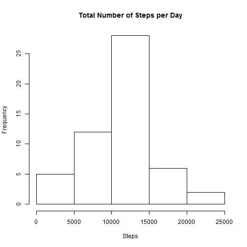
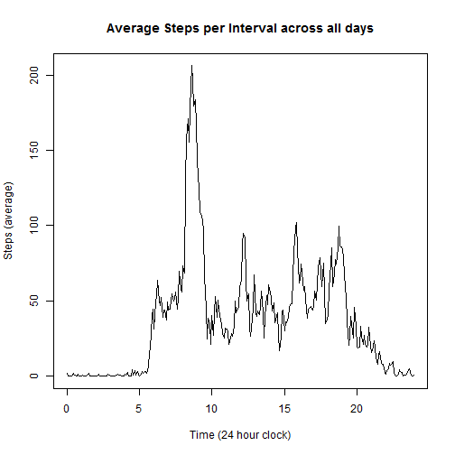
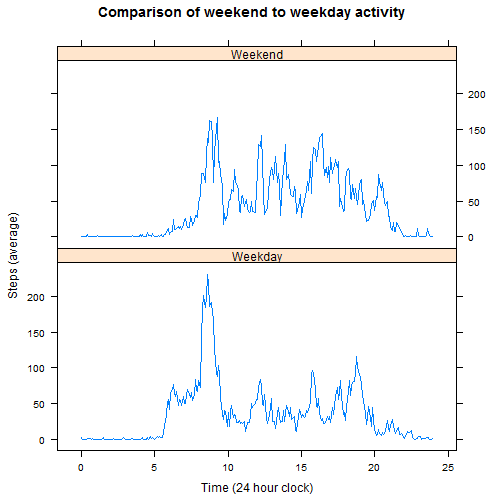

Reproducible Research Assignment 1
==================================

# Introduction

The objective of this assignment is to analyze two months worth activity data stored a personal activity monitoring device in order to answer the following questions:

- What is the mean total number of steps taken per day?
- What is the average daily activity pattern?
- Are there differences in actity patterns between weekdays and weekends?

Additionally, the missing data in the dataset will be quantified and cleansed.

The data is sourced at:

[Activity Data](http://d396qusza40orc.cloudfront.net/repdata%2Fdata%2Factivity.zip)

## Loading libraries Reading the data

As a first step, we load the necessary libraries and read in the data.

```r
library (dplyr)
```

```
## 
## Attaching package: 'dplyr'
## 
## The following objects are masked from 'package:stats':
## 
##     filter, lag
## 
## The following objects are masked from 'package:base':
## 
##     intersect, setdiff, setequal, union
```

```r
library (lattice)

temp <-tempfile()

      fileUrl <- "https://d396qusza40orc.cloudfront.net/repdata%2Fdata%2Factivity.zip"
      download.file(fileUrl,temp)
      activity <-read.csv(unz(temp,"activity.csv",),
      header = TRUE, sep =",",
      colClasses = c("numeric","Date","numeric"))
      
unlink(temp)
```

## Analyze the data and clean the data

Let us look at the structure of the dataframe and the number of invalid entries per variable.

Furthermore, let us create a smaller dataset which purges the "NA" values from the original dataset.

```r
str(activity)
```

```
## 'data.frame':	17568 obs. of  3 variables:
##  $ steps   : num  NA NA NA NA NA NA NA NA NA NA ...
##  $ date    : Date, format: "2012-10-01" "2012-10-01" ...
##  $ interval: num  0 5 10 15 20 25 30 35 40 45 ...
```

```r
nrow(activity[is.na(activity$steps),])
```

```
## [1] 2304
```

```r
nrow(activity[is.na(activity$date),])
```

```
## [1] 0
```

```r
nrow(activity[is.na(activity$interval),])
```

```
## [1] 0
```

```r
activity_rem <- activity[!is.na(activity$steps),]
activity_na <- activity[is.na(activity$steps),]
```

## Analysis of steps per day

In order to calculate the mean total steps, we need to summarize the steps per day. Then we can plot the steps per day in a histogram. Furthermore, we can calculate the mean and median steps per day.


```r
Daily <- summarise(group_by(activity_rem, date), Total = sum(steps))
hist(Daily$Total, main = "Total Number of Steps per Day", xlab = "Steps")
```

 

```r
##Calculate median and mean steps per day

median(Daily$Total)
```

```
## [1] 10765
```

```r
mean(Daily$Total)
```

```
## [1] 10766.19
```

## Analyzing average daily activity

In order to analyze average activity patterns within a day, we average the steps taken in each 5 minute interval across all days. We can furthermore figure out the interval in which the maximum activity occured on average. 


```r
Bytime <- summarise(group_by(activity_rem, interval), Average = mean(steps))

##For graphing purposes, it is more informative to see time than minutes.
##minutes will be calculated as decimals - e.g. 15 minutes = .25 hours

    hours <- Bytime$interval %/% 100
    minutes <- Bytime$interval %% 100

Bytime$displaytime <- hours + (minutes * 1/60)

plot(Bytime$displaytime,Bytime$Average,
     type = "l",
     main = "Average Steps per Interval across all days",
     xlab = "Time (24 hour clock)",
     ylab = "Steps (average)")
```

 

```r
## We can also find the maximum average activity and the associated interval

maxact <- max(Bytime$Average)
maxact
```

```
## [1] 206.1698
```

```r
topinterval <- Bytime[Bytime$Average == maxact,]
topinterval
```

```
## Source: local data frame [1 x 3]
## 
##   interval  Average displaytime
##      (dbl)    (dbl)       (dbl)
## 1      835 206.1698    8.583333
```

So we see that the maximum activity occured at the 8:35 interval.

##Imputing missing values

As seen earlier on, there are a number of rows missing step data. There are different ways to approach this - we could substitute with zeroes, based on an assumption that the lack of data meant that 0 steps were walked. Another, more complex way to adjust for this is to take the average steps per interval which we have previously calculated and replace the missing values with this average. This is illustrated below.


```r
##First we merge the data frame with the missing step counts with the 
##dataframe with average steps per interval

activity_na_merge <- 
  merge (activity_na, Bytime, by.x = "interval", by.y = "interval")

##Now we can replace the steps with the averages and delete unneeded columns

activity_na_merge$steps = activity_na_merge$Average
activity_na_merge$Average <- NULL
activity_na_merge$displaytime <- NULL

#And finally we can create a new dataframe with the cleaned "NA" values
#and add our calculated column for display of the time in the graph.

clean_act <- rbind(activity_rem, activity_na_merge)
    hours <- clean_act$interval %/% 100
    minutes <- clean_act$interval %% 100

clean_act$displaytime <- hours + (minutes * 1/60)
```


##Analyzing the dataset with imputed missing values

We now plot another histogram of the dataset with missing values imputed and look at the mean and median steps per day.


```r
#First we need to summarize the data again by interval

Bytime2 <- summarise(group_by(clean_act, displaytime), Average = mean(steps))

plot(Bytime2$displaytime,Bytime2$Average,
     type = "l",
     main = "Average Steps per Interval across all days",
     xlab = "Time (24 hour clock)",
     ylab = "Steps (average)")
```

 

```r
## Let's also look at the mean and median steps per day.
## In order to do this, we will resummarize the data by date.

Daily2 <- summarise(group_by(clean_act, date), Total = sum(steps))

##Calculate median and mean steps per day

median(Daily2$Total)
```

```
## [1] 10766.19
```

```r
mean(Daily2$Total)
```

```
## [1] 10766.19
```

We can see that the median and average have not changed significantly. Had we taken a different approach and assumed that the missing values were zero, we would have seen the mean and median drop.

## Differences in activity patterns on weekdays versus weekends

It may be interesting to see the difference in activity patterns on weekdays as opposed to weekends.

In order to do this, we need to find the days for the dates on our cleaned file.


```r
clean_act$days <- weekdays(as.Date(clean_act$date,'%d-%m-%Y'))
```

Now we create a variable to indicate whether it is a weekday or not.


```r
clean_act$weekendyn <- ifelse(clean_act$days=="Saturday" | clean_act$days=="Sunday","Weekend","Weekday")
```

Now we will plot the data in two windows.


```r
Bytime2 <- summarise(group_by(clean_act, weekendyn, displaytime), Average = mean(steps))
xyplot(Average~displaytime|weekendyn,
       data=Bytime2,
       type="l",
       layout=c(1,2),
     main = "Comparison of weekend to weekday activity",
     xlab = "Time (24 hour clock)",
     ylab = "Steps (average)")
```

 

We can observe that, while there are similarities in the activity patterns, weekend activity is more evenly spread throughout the day, while during weekdays the activity tapers off more sharply after about 9am.
